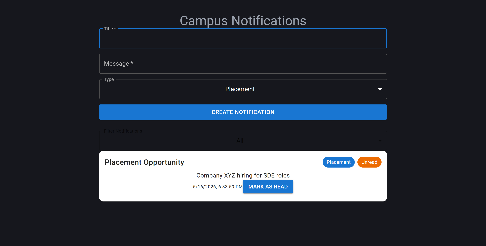
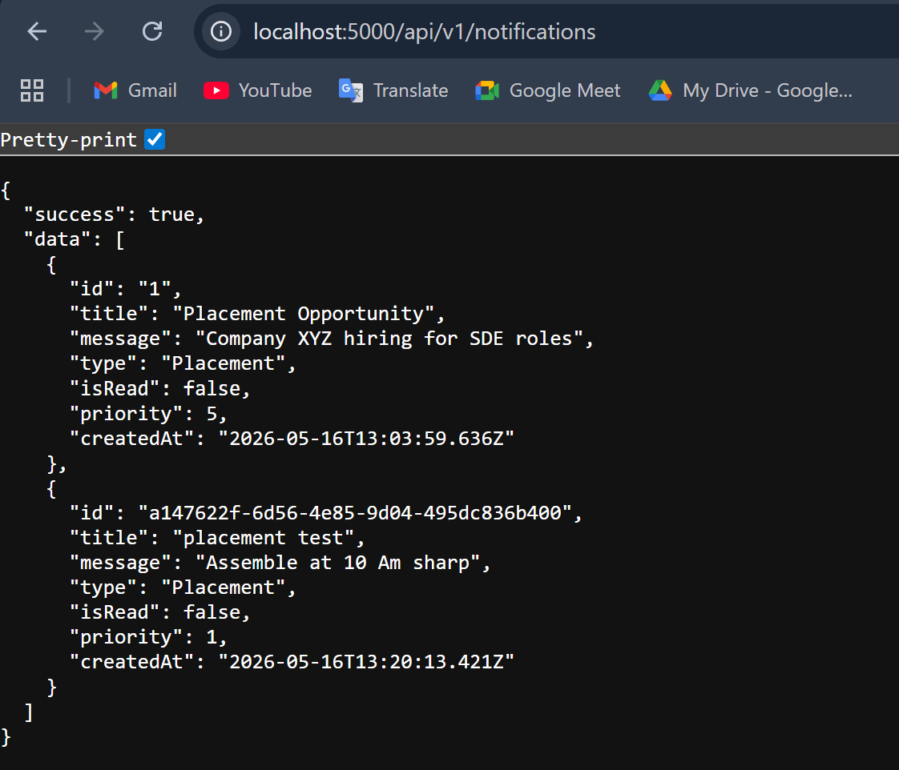

# Logging Middleware

Reusable TypeScript logging middleware for frontend and backend applications.

## Features

- Structured logging
- Multiple log levels
- Remote logging support
- Reusable package architecture
- Type-safe implementation

## Usage

```ts
await Log(
  "backend",
  "info",
  "notification-service",
  "Notification dispatched successfully"
);
```


<video controls src="20260516-1319-53.4328128.mp4" title=""></video>
